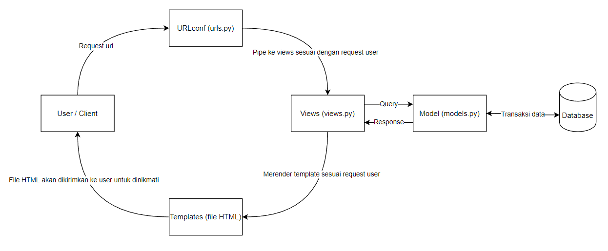

# Katalog Saya
[Klik disini untuk mengakses :)](https://tugas-2-pbp-neozap.herokuapp.com/katalog/)

## Bagan

###### Referensi: https://pbp-fasilkom-ui.github.io/ganjil-2023/assignments/tutorial/tutorial-1/

1. User / Client memasukkan url.
2. URL yang diberikan Client kita proses pada `urls.py`, dan nanti kita masukkan ke views sesuai dengan yang diminta user.
3. Pada app katalog, views (`views.py`) menquery data katalog pada `../db.sqlite3` yang sudah sesuai dengan model yang telah kita definisikan pada `models.py`. Isi dari `../db.sqlite3` tersebut adalah data yang kita berikan pada `fixtures/initial_catalog_data.json`.
4. Selanjutnya, views selayaknya API, akan merender template (`templates/katalog.html`) sesuai request user dengan data yang sudah kita query tadi dengan tambahan Nama dan NPM sebagai context agar bisa ditampilkan pada `templates/katalog.html`.

## Jelaskan kenapa menggunakan virtual environment? 
Dengan virtual environment, kita dapat memaintain aplikasi kita dengan lebih mudah. Dikarenakan virtual environment benar-benar membuat environment baru sehingga module module kita terdahulu tidak akan masuk pada aplikasi kita. Hal tersebut sangatlah membantu karena module module kita terdahulu bisa saja memiliki ukuran besar dan belum tentu berguna bagi aplikasi kita. Selain itu aplikasi kita dapat ditest oleh user atau diakses dari device lain dengan lebih mudah, dikarenakan adanya file `requirements.txt` yang berisi module module beserta versinya yang diperlukan untuk aplikasi kita.

## Apakah kita tetap dapat membuat aplikasi web berbasis Django tanpa menggunakan virtual environment?
Bisa, tetapi akan sangat rentan terhadap error. Misal jika kita memiliki suatu module yang tidak dapat diinstall oleh pihak deployer, maka deploy kita tidak berhasil. Selain itu, ukuran aplikasi web kita akan sangat besar, atau pastinya akan semakin besar lama kelamaan. Hal tersebut dikarenakan kebutuhan kita untuk menginstall module baru, dan jika kita tidak menggunakan virtual environment pasti aplikasi web kita akan ikut menginstall module tersebut yang mengakibatkan pada penumpukan ukuran / size aplikasi pada hal yang tidak mesti diperlukan.

## Jelaskan bagaimana cara kamu mengimplementasikan poin 1 sampai dengan 4 di atas.
1. Pertama-tama lakukan `python manage.py makemigrations` untuk membuat folder `katalog/migrations` yang berisi class `Migration` yang berfungsi untuk memigrasi skema model data kepada database yang dapat dijalankan dengan perintah `python manage.py migrate`. Selanjutnya lakukan `python manage.py loaddata initial_catalog_data.json` untuk memasukkan data json pada `initial_catalog_data.json` ke database kita. Pada `katalog/views.py` terdapat fungsi `show_katalog` yang mengambil data dari database yang sudah kita setup tadi dengan `CatalogItem.objects.all()` lalu dirender pada file `katalog/templates/katalog.html` sebagai context sehingga dapat diakses pada file html tersebut.
2. Pada `katalog/urls.py` tambahkan sebuah path pada `urlpatterns` path yang memanggil fungsi `show_katalog`
3. Context yang dirender pada tahap 1 dapat kita akses menggunakan syntax django `{}`. Contohnya, untuk mengakses variabel name kita gunakan syntax `{{name}}` lalu untuk melakukan for pada list `item_catalog` gunakan syntax ``. Syntax lainnya dapat dilihat pada dokumentasi Django.
4. Lakukan deploy pada heroku dengan membuat app dulu pada heroku serta mengimport API_KEY dan APP_NAME pada repository secrets, lalu pada setiap push file `deploy.yml` akan secara otomatis mendeploy aplikasi kita.